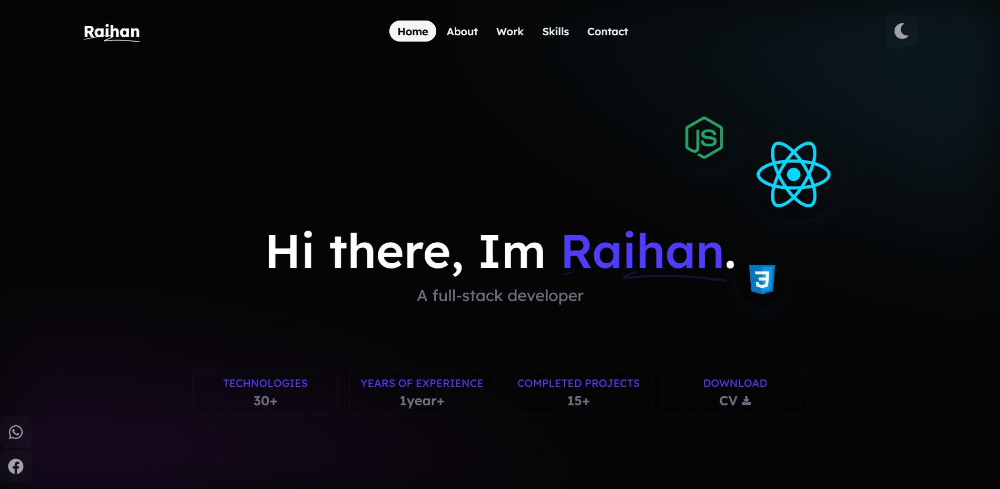

<h2 align="center">
  Portfolio Website 
  <a href="https://asmraihan.web.app/" target="_blank">raihan.me</a>
</h2>

  
  

 

## Built With

<a href="https://asmraihan.web.app/" target="_blank">raihan.me</a><a href="https://asmraihan.vercel.app/" target="_blank"> (or vercel)</a> features some of my github projects as well as my resume and technical skills. 

This project was built using these technologies.

- React.js
- Tailwind CSS
- Framer motion
- React Three

## Features

**🎨 Styled with Tailwind Css**

**📱 Fully Responsive**

### Give a ⭐ if you like my portfolio!
